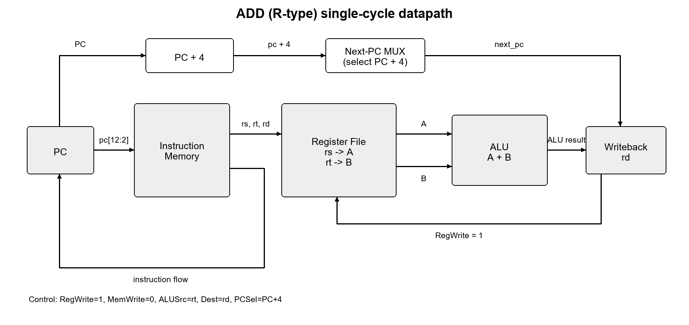

# 54 条指令 CPU 设计实验报告

> 工程：`cpu_54`　目标器件：`xc7a100tcsg324-1`　工具：Vivado 2016.2 / Vivado XSim
>
> 说明：指导书中的示例截图位置保留在本文中，由提交者根据本机 Vivado 波形窗口补图。本工程按要求使用 Vivado/XSim 完成验证，没有使用 ModelSim。

## 一、实验内容

本实验在已有 31 条指令单周期 MIPS CPU 的基础上扩展完成 54 条指令 CPU。设计内容包括：

1. 扩展立即数运算、移位、分支跳转、字节/半字访存、乘除法、HI/LO 访问和 CP0 异常处理等指令。
2. 使用 Vivado Distributed Memory Generator IP 实现指令 ROM，并使用老师提供的 COE 初始化程序存储器。
3. 使用 Vivado XSim 完成老师网站测试程序、单条指令测试、除法专项测试和 CP0 异常测试。
4. 综合、布局布线后生成时序网表和 SDF，完成后实现时序分析，并生成可下板的 bitstream。

本工程的 CPU 主体仍是单周期数据通路：普通指令在一个时钟周期内完成取指、译码、执行和写回；`div`/`divu` 使用 32 次迭代的内部多周期除法器，除法期间保持 PC 不变，完成后再提交 HI/LO 并更新 PC。

## 二、CPU 数据通路设计

### 2.1 设计约定与模块

当前综合/仿真使用的主要模块如下：

| 模块 | 作用 |
|---|---|
| `sccpu.v` | CPU 核心、组合译码、PC/HI/LO/CP0 状态寄存器 |
| `regfile.v` | 32 个 32 位通用寄存器，$0 恒为 0 |
| `scinstmem.v` | 指令地址到 ROM 字地址的映射，调用 `imem` IP |
| `imem.v` | Vivado Distributed Memory Generator 生成的 ROM 封装 |
| `scdatamem.v` | 数据存储器及字节、半字、字读写和符号扩展 |
| `sccomp_dataflow.v` | 前仿真顶层，输出 `pc` 和 `inst` |
| `postsim_top.v` | 后仿真/时序分析顶层，输出 `pc`、`inst`、`mem0`、`mem1` |
| `cpu54_board.v` / `test.v` | 下板顶层，分频执行并将 PC 送往七段数码管 |

PC 复位值为 `0x00400000`，指令 ROM 和数据 RAM 内部使用低地址映射。指令 ROM 端口地址为 `pc[12:2]`，因此每个 ROM 单元对应一条 32 位指令。

### 2.2 示例：`add rd, rs, rt` 数据通路

示例图如下，表示 R 型算术指令从取指到寄存器写回的主要路径：



原图文件：[add_rtype_datapath.png](datapath_diagrams/add_rtype_datapath.png)。

`add` 的数据流为：`PC -> IMEM -> rs/rt/rd 字段 -> RegFile -> ALU(A+B) -> rd 写回`；同时 `PC+4` 经过下一 PC 选择器回写 PC。控制条件为 `RegWrite=1`、`MemWrite=0`、`ALUSrc=rt`、目标寄存器为 `rd`、`PCSel=PC+4`。

### 2.3 各类指令数据通路和执行流程

所有普通指令共享取指阶段：

```text
PC -> 指令 ROM -> inst[31:0] -> 字段分解/寄存器读出
PC -> PC+4
```

下表给出每条指令的主要数据通路和从取指到执行的流程。除 `div/divu` 外，表中的 `T0` 表示同一个时钟周期内完成。

| 指令 | 主要数据通路 | 指令流程 |
|---|---|---|
| `sll` | `rt -> ALU(SLL) -> rd` | `T0: 取指 -> 读 rt/shamt -> 移位 -> 写 rd -> PC+4` |
| `srl` | `rt -> ALU(SRL) -> rd` | `T0: 取指 -> 读 rt/shamt -> 移位 -> 写 rd -> PC+4` |
| `sra` | `rt -> ALU(SRA) -> rd` | `T0: 取指 -> 读 rt/shamt -> 算术移位 -> 写 rd -> PC+4` |
| `sllv` | `rt, rs[4:0] -> ALU(SLLV) -> rd` | `T0: 取指 -> 读 rs/rt -> 变量移位 -> 写 rd -> PC+4` |
| `srlv` | `rt, rs[4:0] -> ALU(SRLV) -> rd` | `T0: 取指 -> 读 rs/rt -> 变量移位 -> 写 rd -> PC+4` |
| `srav` | `rt, rs[4:0] -> ALU(SRAV) -> rd` | `T0: 取指 -> 读 rs/rt -> 算术变量移位 -> 写 rd -> PC+4` |
| `add` / `addu` | `rs, rt -> ALU(ADD) -> rd` | `T0: 取指 -> 读 rs/rt -> 加法 -> 写 rd -> PC+4` |
| `sub` / `subu` | `rs, rt -> ALU(SUB) -> rd` | `T0: 取指 -> 读 rs/rt -> 减法 -> 写 rd -> PC+4` |
| `and` | `rs, rt -> ALU(AND) -> rd` | `T0: 取指 -> 读 rs/rt -> 与 -> 写 rd -> PC+4` |
| `or` | `rs, rt -> ALU(OR) -> rd` | `T0: 取指 -> 读 rs/rt -> 或 -> 写 rd -> PC+4` |
| `xor` | `rs, rt -> ALU(XOR) -> rd` | `T0: 取指 -> 读 rs/rt -> 异或 -> 写 rd -> PC+4` |
| `nor` | `rs, rt -> ALU(NOR) -> rd` | `T0: 取指 -> 读 rs/rt -> 或非 -> 写 rd -> PC+4` |
| `slt` | `rs, rt -> signed compare -> rd` | `T0: 取指 -> 有符号比较 -> 写 rd -> PC+4` |
| `sltu` | `rs, rt -> unsigned compare -> rd` | `T0: 取指 -> 无符号比较 -> 写 rd -> PC+4` |
| `addi` / `addiu` | `rs + sign_ext(imm16) -> rt` | `T0: 取指 -> 符号扩展 -> 加法 -> 写 rt -> PC+4` |
| `slti` | `rs, sign_ext(imm16) -> signed compare -> rt` | `T0: 取指 -> 符号扩展 -> 比较 -> 写 rt -> PC+4` |
| `sltiu` | `rs, sign_ext(imm16) -> unsigned compare -> rt` | `T0: 取指 -> 符号扩展 -> 比较 -> 写 rt -> PC+4` |
| `andi` | `rs & zero_ext(imm16) -> rt` | `T0: 取指 -> 零扩展 -> 与 -> 写 rt -> PC+4` |
| `ori` | `rs \| zero_ext(imm16) -> rt` | `T0: 取指 -> 零扩展 -> 或 -> 写 rt -> PC+4` |
| `xori` | `rs ^ zero_ext(imm16) -> rt` | `T0: 取指 -> 零扩展 -> 异或 -> 写 rt -> PC+4` |
| `lui` | `{imm16,16'b0} -> rt` | `T0: 取指 -> 立即数移位 -> 写 rt -> PC+4` |
| `beq` | `rs == rt`, `PC+4 + sign_ext(imm16)<<2` | `T0: 取指 -> 比较 -> 相等则分支，否则 PC+4` |
| `bne` | `rs != rt`, `PC+4 + sign_ext(imm16)<<2` | `T0: 取指 -> 比较 -> 不等则分支，否则 PC+4` |
| `bgez` | `rs[31]==0`, 分支目标 | `T0: 取指 -> 检查符号位 -> 满足则分支，否则 PC+4` |
| `j` | `{PC+4[31:28], imm26, 2'b0}` | `T0: 取指 -> 拼接跳转地址 -> 写 PC` |
| `jal` | 跳转地址，`PC+4 -> r31` | `T0: 取指 -> 写 r31 -> 写跳转目标 PC` |
| `jr` | `rs -> PC` | `T0: 取指 -> 读 rs -> 写 PC` |
| `jalr` | `PC+4 -> rd/r31`，`rs -> PC` | `T0: 取指 -> 保存返回地址 -> 写 PC` |
| `lw` | `rs+sign_ext(imm16) -> DMEM -> rt` | `T0: 地址计算 -> 读字 -> 符号扩展/写 rt -> PC+4` |
| `lh` | `rs+imm -> DMEM[15:0] -> sign_ext -> rt` | `T0: 地址计算 -> 读半字 -> 符号扩展 -> 写 rt` |
| `lhu` | `rs+imm -> DMEM[15:0] -> zero_ext -> rt` | `T0: 地址计算 -> 读半字 -> 零扩展 -> 写 rt` |
| `lb` | `rs+imm -> DMEM[7:0] -> sign_ext -> rt` | `T0: 地址计算 -> 读字节 -> 符号扩展 -> 写 rt` |
| `lbu` | `rs+imm -> DMEM[7:0] -> zero_ext -> rt` | `T0: 地址计算 -> 读字节 -> 零扩展 -> 写 rt` |
| `sw` | `rt -> DMEM[addr]` | `T0: 地址计算 -> 写 32 位数据 -> PC+4` |
| `sh` | `rt[15:0] -> DMEM[addr]` | `T0: 地址计算 -> 写半字 -> PC+4` |
| `sb` | `rt[7:0] -> DMEM[addr]` | `T0: 地址计算 -> 写字节 -> PC+4` |
| `mult` / `multu` | `rs * rt -> HI/LO` | `T0: 取指 -> 乘法 -> 写 HI/LO -> PC+4` |
| `div` / `divu` | `rs / rt -> LO`, `rs % rt -> HI` | `T0: 锁存被除数/除数；T1-T32: 迭代；T33: 提交 HI/LO 并更新 PC` |
| `mfhi` | `HI -> rd` | `T0: 取指 -> 读 HI -> 写 rd -> PC+4` |
| `mthi` | `rs -> HI` | `T0: 取指 -> 读 rs -> 写 HI -> PC+4` |
| `mflo` | `LO -> rd` | `T0: 取指 -> 读 LO -> 写 rd -> PC+4` |
| `mtlo` | `rs -> LO` | `T0: 取指 -> 读 rs -> 写 LO -> PC+4` |
| `mfc0` | `CP0(rd) -> rt` | `T0: 取指 -> 读 CP0 -> 写 rt -> PC+4` |
| `mtc0` | `rt -> CP0(rd)` | `T0: 取指 -> 读 rt -> 写 CP0 -> PC+4` |
| `clz` | `rs -> leading-zero counter -> rd` | `T0: 取指 -> 统计前导零 -> 写 rd -> PC+4` |
| `syscall` | `PC -> EPC`, 异常码 -> Cause, `EXC_ENTRY -> PC` | `T0: 取指 -> 保存 EPC/Cause -> 跳异常入口` |
| `break` | `PC -> EPC`, 异常码 -> Cause, `EXC_ENTRY -> PC` | `T0: 取指 -> 保存 EPC/Cause -> 跳异常入口` |
| `teq` | `rs == rt` 时异常 | `T0: 取指 -> 比较 -> 满足条件则进入异常入口` |
| `eret` | `EPC+4 -> PC` | `T0: 取指 -> 读 EPC -> 写 PC` |

### 2.4 总数据通路

总数据通路由以下路径组成：

```text
                         +------------------+
                         |      PC          |
                         +--------+---------+
                                  | pc[12:2]
                         +--------v---------+
                         |  IMEM / imem IP  |
                         +--------+---------+
                                  | inst
       +--------------------------+--------------------------+
       |                          |                          |
   rs/rt/rd/shamt              imm16/imm26                 funct/opcode
       |                          |                          |
 +-----v------+             +-----v------+             +-----v------+
 | Register   |             | Ext/Shift  |             | Controller |
 | File       |             | Units      |             | / Decoder  |
 +--+------+--+             +-----+------+             +-----+------+
    |      |                       |                          |
    |      +-----------------------+--------------------------+
    |                              |
    +---------------------> +------v------+ <-------------------+
                            |    ALU      |       HI/LO/CP0 mux |
                            +------+------+                     |
                                   | ALU result                 |
                   +---------------+----------------+            |
                   |                                |            |
             +-----v------+                  +------v------+     |
             | Data RAM   |                  | HI / LO /   |     |
             | lb/lh/lw  |                  | CP0         |     |
             +-----+------+                  +------+------+
                   | load data                       |
                   +---------------+-----------------+
                                   |
                            +------v------+
                            | Writeback   |
                            | rd/rt/r31   |
                            +-------------+

PC+4, branch target, jump target, jr/jalr target and eret target
are selected by the next-PC logic and written back to PC.
```

完整总图和按指令拆分图已生成：`datapath_diagrams/` 中包含 54 张单条指令数据通路图、1 张总数据通路图和 1 张版式示例图；`instruction_flow_diagrams/` 中包含 54 张单条指令流程图。文件名与指令名一致，例如 `datapath_diagrams/lw.png` 和 `instruction_flow_diagrams/lw.png`。

总图：[cpu54_total_datapath.png](datapath_diagrams/cpu54_total_datapath.png)。

单条指令图索引：

| 指令 | 数据通路图 | 指令流程图 | 指令 | 数据通路图 | 指令流程图 |
|---|---|---|---|---|---|
| `sll` | [图](datapath_diagrams/sll.png) | [流程](instruction_flow_diagrams/sll.png) | `srl` | [图](datapath_diagrams/srl.png) | [流程](instruction_flow_diagrams/srl.png) |
| `sra` | [图](datapath_diagrams/sra.png) | [流程](instruction_flow_diagrams/sra.png) | `sllv` | [图](datapath_diagrams/sllv.png) | [流程](instruction_flow_diagrams/sllv.png) |
| `srlv` | [图](datapath_diagrams/srlv.png) | [流程](instruction_flow_diagrams/srlv.png) | `srav` | [图](datapath_diagrams/srav.png) | [流程](instruction_flow_diagrams/srav.png) |
| `add` | [图](datapath_diagrams/add.png) | [流程](instruction_flow_diagrams/add.png) | `addu` | [图](datapath_diagrams/addu.png) | [流程](instruction_flow_diagrams/addu.png) |
| `sub` | [图](datapath_diagrams/sub.png) | [流程](instruction_flow_diagrams/sub.png) | `subu` | [图](datapath_diagrams/subu.png) | [流程](instruction_flow_diagrams/subu.png) |
| `and` | [图](datapath_diagrams/and.png) | [流程](instruction_flow_diagrams/and.png) | `or` | [图](datapath_diagrams/or.png) | [流程](instruction_flow_diagrams/or.png) |
| `xor` | [图](datapath_diagrams/xor.png) | [流程](instruction_flow_diagrams/xor.png) | `nor` | [图](datapath_diagrams/nor.png) | [流程](instruction_flow_diagrams/nor.png) |
| `slt` | [图](datapath_diagrams/slt.png) | [流程](instruction_flow_diagrams/slt.png) | `sltu` | [图](datapath_diagrams/sltu.png) | [流程](instruction_flow_diagrams/sltu.png) |
| `addi` | [图](datapath_diagrams/addi.png) | [流程](instruction_flow_diagrams/addi.png) | `addiu` | [图](datapath_diagrams/addiu.png) | [流程](instruction_flow_diagrams/addiu.png) |
| `slti` | [图](datapath_diagrams/slti.png) | [流程](instruction_flow_diagrams/slti.png) | `sltiu` | [图](datapath_diagrams/sltiu.png) | [流程](instruction_flow_diagrams/sltiu.png) |
| `andi` | [图](datapath_diagrams/andi.png) | [流程](instruction_flow_diagrams/andi.png) | `ori` | [图](datapath_diagrams/ori.png) | [流程](instruction_flow_diagrams/ori.png) |
| `xori` | [图](datapath_diagrams/xori.png) | [流程](instruction_flow_diagrams/xori.png) | `lui` | [图](datapath_diagrams/lui.png) | [流程](instruction_flow_diagrams/lui.png) |
| `beq` | [图](datapath_diagrams/beq.png) | [流程](instruction_flow_diagrams/beq.png) | `bne` | [图](datapath_diagrams/bne.png) | [流程](instruction_flow_diagrams/bne.png) |
| `bgez` | [图](datapath_diagrams/bgez.png) | [流程](instruction_flow_diagrams/bgez.png) | `j` | [图](datapath_diagrams/j.png) | [流程](instruction_flow_diagrams/j.png) |
| `jal` | [图](datapath_diagrams/jal.png) | [流程](instruction_flow_diagrams/jal.png) | `jr` | [图](datapath_diagrams/jr.png) | [流程](instruction_flow_diagrams/jr.png) |
| `jalr` | [图](datapath_diagrams/jalr.png) | [流程](instruction_flow_diagrams/jalr.png) | `lw` | [图](datapath_diagrams/lw.png) | [流程](instruction_flow_diagrams/lw.png) |
| `lh` | [图](datapath_diagrams/lh.png) | [流程](instruction_flow_diagrams/lh.png) | `lhu` | [图](datapath_diagrams/lhu.png) | [流程](instruction_flow_diagrams/lhu.png) |
| `lb` | [图](datapath_diagrams/lb.png) | [流程](instruction_flow_diagrams/lb.png) | `lbu` | [图](datapath_diagrams/lbu.png) | [流程](instruction_flow_diagrams/lbu.png) |
| `sw` | [图](datapath_diagrams/sw.png) | [流程](instruction_flow_diagrams/sw.png) | `sh` | [图](datapath_diagrams/sh.png) | [流程](instruction_flow_diagrams/sh.png) |
| `sb` | [图](datapath_diagrams/sb.png) | [流程](instruction_flow_diagrams/sb.png) | `mult` | [图](datapath_diagrams/mult.png) | [流程](instruction_flow_diagrams/mult.png) |
| `multu` | [图](datapath_diagrams/multu.png) | [流程](instruction_flow_diagrams/multu.png) | `div` | [图](datapath_diagrams/div.png) | [流程](instruction_flow_diagrams/div.png) |
| `divu` | [图](datapath_diagrams/divu.png) | [流程](instruction_flow_diagrams/divu.png) | `mfhi` | [图](datapath_diagrams/mfhi.png) | [流程](instruction_flow_diagrams/mfhi.png) |
| `mthi` | [图](datapath_diagrams/mthi.png) | [流程](instruction_flow_diagrams/mthi.png) | `mflo` | [图](datapath_diagrams/mflo.png) | [流程](instruction_flow_diagrams/mflo.png) |
| `mtlo` | [图](datapath_diagrams/mtlo.png) | [流程](instruction_flow_diagrams/mtlo.png) | `mfc0` | [图](datapath_diagrams/mfc0.png) | [流程](instruction_flow_diagrams/mfc0.png) |
| `mtc0` | [图](datapath_diagrams/mtc0.png) | [流程](instruction_flow_diagrams/mtc0.png) | `clz` | [图](datapath_diagrams/clz.png) | [流程](instruction_flow_diagrams/clz.png) |
| `syscall` | [图](datapath_diagrams/syscall.png) | [流程](instruction_flow_diagrams/syscall.png) | `break` | [图](datapath_diagrams/break.png) | [流程](instruction_flow_diagrams/break.png) |
| `teq` | [图](datapath_diagrams/teq.png) | [流程](instruction_flow_diagrams/teq.png) | `eret` | [图](datapath_diagrams/eret.png) | [流程](instruction_flow_diagrams/eret.png) |

## 三、CPU 控制部件设计

### 3.1 指令操作时间表

操作时间表已经单独整理为 Excel 文件：[CPU54_操作时间表及控制信号逻辑表达式.xlsx](CPU54_操作时间表及控制信号逻辑表达式.xlsx)。

普通指令的控制时间表为：

| 时间 | 操作 |
|---|---|
| `T0` | `IR <- IMEM[PC]`，读取 `rs/rt`，计算 `PC+4`，完成 ALU/访存/写回，并根据条件更新 PC |
| `T1...T32` | 仅用于 `div/divu` 的逐位恢复除法迭代，PC 保持不变 |
| `T33` | `div/divu` 结果符号修正，`HI <- remainder`、`LO <- quotient`，`PC <- next_pc` |

### 3.2 控制信号逻辑表达式

设：

- `R_ALU = (opcode=0) & funct in {00,02,03,04,06,07,20,21,22,23,24,25,26,27,2A,2B}`；
- `I_ARITH = opcode in {08,09,0A,0B,0C,0D,0E,0F}`；
- `LOAD = opcode in {20,21,23,24,25}`；
- `STORE = opcode in {28,29,2B}`；
- `BR_EQ = opcode=04`，`BR_NE = opcode=05`，`BR_GE0 = opcode=01 & rt=01`；
- `J = opcode=02`，`JAL = opcode=03`，`JR = opcode=0 & funct=08`，`JALR = opcode=0 & funct=09`；
- `MULT = opcode=0 & funct in {18,19}`，`DIV = opcode=0 & funct in {1A,1B}`；
- `HI_RD = funct=10`，`HI_WR = funct=11`，`LO_RD = funct=12`，`LO_WR = funct=13`；
- `MFC0 = opcode=10 & rs=0`，`MTC0 = opcode=10 & rs=4`，`ERET = opcode=10 & rs=10 & funct=18`；
- `EXC = (funct=0C) | (funct=0D) | (funct=34 & rs_data=rt_data)`；
- `CLZ = opcode=1C & funct=20`。

当前 `sccpu.v` 的主要控制信号可写为：

```text
reg_we      = R_ALU | I_ARITH | LOAD | JAL | JALR | HI_RD | LO_RD | MFC0 | CLZ
mem_we      = STORE
mem_addr    = rs_data + sign_ext_imm
mem_wdata   = rt_data
store_size  = SB/SH/SW 对应 opcode 28/29/2B
load_size   = LB/LH/LW/LBU/LHU 对应 opcode 20/21/23/24/25
load_unsigned = (opcode=24) | (opcode=25)
reg_waddr   = R_ALU/HI_RD/LO_RD/JALR/CLZ 时取 rd，否则取 rt；JAL 取 r31
reg_wdata   = ALU_result 或 mem_rdata 或 PC+4 或 LUI 或 HI/LO/CP0 数据
```

下一 PC 逻辑为：

```text
next_pc = PC + 4                         (默认)
next_pc = branch_target                  (BR_EQ & rs_data==rt_data)
next_pc = branch_target                  (BR_NE & rs_data!=rt_data)
next_pc = branch_target                  (BR_GE0 & rs_data[31]==0)
next_pc = jump_target                    (J | JAL)
next_pc = rs_data                        (JR | JALR)
next_pc = cp0_epc + 4                    (ERET)
next_pc = EXC_ENTRY                      (EXC)
```

状态寄存器控制为：

- `MULT/MULTU`：计算 64 位乘积，`HI <- result[63:32]`，`LO <- result[31:0]`；
- `DIV/DIVU`：启动 `div_busy`，迭代 32 次；完成时写 `HI/LO`；除数为 0 时不启动迭代；
- `MTHI/MTLO`：分别写 HI、LO；`MFHI/MFLO`：分别从 HI、LO 写通用寄存器；
- `MTC0`：根据 `rd` 写 `cp0_reg8`、`cp0_status`、`cp0_cause` 或 `cp0_epc`；
- `SYSCALL/BREAK/TEQ`：保存 `cp0_epc=PC`，写入异常码到 `cp0_cause`，跳转 `EXC_ENTRY=0x00400004`。

### 3.3 控制部件设计

#### 3.3.1 设计目标和总体组织

控制部件的任务不是直接完成算术或访存，而是根据当前指令产生数据通路所需的选择、写使能和状态更新条件。本设计采用“组合译码 + 时序状态寄存器”的组织方式：

1. 组合译码部分只读取当前 `inst`、寄存器堆读数据和当前状态，形成 `reg_we`、`mem_we`、ALU 运算选择、写回数据选择、`next_pc`、HI/LO 下一值和 CP0 下一值。
2. 时序部分在时钟上升沿统一提交 PC、通用寄存器、HI/LO、CP0 以及除法器内部寄存器。
3. 普通指令不设置额外状态，组合路径在一个周期内从取指贯通到写回；只有 `div/divu` 使用 `div_busy` 和 `div_count` 保存跨周期状态。

这种组织方式与单周期 CPU 的数据通路相匹配：控制信号随指令组合产生，状态只在时钟边沿改变，避免了把普通指令人为拆成多个状态而增加控制复杂度。

#### 3.3.2 控制器的输入和输出

控制器的主要输入可以分为四组：

| 输入组 | 信号 | 用途 |
|---|---|---|
| 指令字段 | `opcode`、`funct`、`rs`、`rt`、`rd`、`shamt`、`imm16`、`imm26` | 判断指令类别、选择源/目的寄存器和立即数形式 |
| 通用数据 | `rs_data`、`rt_data` | ALU 运算、分支比较、地址计算、HI/LO/CP0 写入 |
| 当前状态 | `pc`、`hi`、`lo`、`cp0_*`、`div_busy`、`div_count` | 形成下一 PC、读出特殊寄存器和控制除法器阶段 |
| 存储器反馈 | `mem_rdata` | 形成 `lw/lh/lhu/lb/lbu` 的写回数据 |

输出也分为四组：

- 数据通路控制：ALU 操作数选择、ALU 运算类型、访存宽度、符号/零扩展、寄存器写地址和写回数据；
- 存储器控制：`mem_we`、`mem_addr`、`mem_wdata`、`mem_store_size`、`mem_load_size`、`mem_load_unsigned`；
- PC 控制：默认顺序执行、分支目标、跳转目标、寄存器跳转、异常入口和 `eret` 返回；
- 状态更新：`hi_next`、`lo_next`、`cp0_*_next`，以及除法器启动、迭代和结束条件。

#### 3.3.3 分层译码思想

译码采用“先按主操作码分类，再按功能码细分”的层次结构。

1. `opcode=000000` 时进入 R 型指令组，再由 `funct` 区分移位、算术逻辑、比较、跳转、HI/LO、乘法、除法和异常指令。
2. `opcode=000001` 单独识别 `bgez`，同时检查 `rt=00001`，避免把同一主操作码下的其他编码误认为有效指令。
3. `opcode=000010/000011` 处理 `j/jal`，二者共享跳转地址生成逻辑，`jal` 额外打开链接地址写回。
4. `opcode=000100/000101` 处理 `beq/bne`，比较结果只影响 PC 选择，不打开寄存器写使能。
5. `opcode=001000` 至 `001111` 处理立即数算术、比较、逻辑和 `lui`，其中逻辑立即数采用零扩展，其余算术/比较立即数采用符号扩展。
6. `opcode=010000` 处理 CP0 指令，通过 `rs` 字段区分 `mfc0`、`mtc0` 和 `eret`。
7. `opcode=100000` 至 `101011` 处理字节、半字和字访存，地址计算共用 `rs+sign_ext(imm16)`，宽度和扩展方式由主操作码决定。
8. `opcode=011100` 且 `funct=100000` 识别 `clz`，使用独立的前导零统计组合逻辑。

分层译码的优点是控制条件互斥、信号来源清晰，便于为每个类别先设默认值，再只覆盖该类别需要改变的控制项。

#### 3.3.4 默认值和互斥控制

每次译码开始时，控制器将所有写使能置零，将 `next_pc` 置为 `pc_plus4`，将访存宽度置为默认字宽，将 HI/LO 和 CP0 下一值保持为当前值。随后仅由当前指令覆盖必要字段。这样设计有三点作用：

- 对未实现或保留编码，CPU 退化为“不写寄存器、不写内存、PC 顺序前进”，不会产生随机写操作；
- 分支、跳转、访存和特殊寄存器写入不会同时误触发；
- `reg_wdata`、`mem_wdata` 等组合信号始终有确定值，便于综合和波形观察。

控制信号之间还遵循互斥关系：`mem_we` 只对 `sb/sh/sw` 有效；`reg_we` 只对具有通用寄存器结果的指令有效；分支/跳转指令通常不写通用寄存器，只有 `jal/jalr` 同时产生 PC 跳转和链接地址写回。

#### 3.3.5 数据通路控制策略

ALU 的操作数 A 统一来自 `rs_data`。操作数 B 根据指令类型选择 `rt_data` 或扩展后的立即数：R 型算术、逻辑、移位和比较指令使用寄存器操作数；立即数运算和访存地址计算使用 `sign_ext_imm` 或 `zero_ext_imm`。`lui` 不经过普通 ALU 运算，而是直接把立即数放入高 16 位。

写回控制采用结果来源选择思想：

- ALU 类指令选择 `ALU_result`；
- Load 类指令选择 `mem_rdata`；
- `jal/jalr` 选择 `pc_plus4`；
- `mfhi/mflo` 选择 HI/LO；
- `mfc0` 选择 CP0 读数据；
- `clz` 选择前导零统计结果。

目的寄存器选择也集中处理：R 型、移位、比较、HI/LO 读出和 `clz` 使用 `rd`；I 型和 Load 使用 `rt`；`jal` 固定使用 `$31`；`jalr` 使用编码中的 `rd`，当 `rd=0` 时按本设计约定写 `$31`。寄存器堆内部进一步禁止对 `$0` 的有效写入，并保持 `$0=0`。

#### 3.3.6 PC 控制策略

PC 控制采用“默认顺序、条件覆盖”的优先级结构：

1. 默认值为 `pc_plus4`，保证普通顺序指令自动前进；
2. `beq/bne/bgez` 根据比较条件选择 `branch_target`；
3. `j/jal` 选择由 `pc_plus4` 高 4 位和 `imm26<<2` 拼接得到的 `jump_target`；
4. `jr/jalr` 选择 `rs_data`；
5. `eret` 选择 `cp0_epc + 4`，返回异常指令之后的指令；
6. `syscall/break/teq` 发生异常时，最后覆盖为 `EXC_ENTRY`，同时保存 EPC 和 Cause。

异常覆盖位于普通 PC 选择之后，因此异常条件满足时能够保证异常入口优先于顺序 PC 或分支 PC。当前实验入口地址为 `0x00400004`，CP0 专项测试时可通过顶层参数匹配测试程序入口布局。

#### 3.3.7 HI/LO、乘法和除法控制

HI/LO 被作为 CPU 内部的两个独立 32 位状态寄存器管理。`mult/multu` 在当前周期形成 64 位乘积，低 32 位写 LO，高 32 位写 HI；`mthi/mtlo` 直接用 `rs_data` 更新对应寄存器；`mfhi/mflo` 将当前 HI/LO 送入通用寄存器写回通路。

除法器采用单独的多周期控制序列：

- 启动条件：当前指令是 `div/divu` 且除数非零；锁存被除数、除数、商、余数和符号信息，置 `div_busy=1`；
- 迭代阶段：每个有效时钟完成一次移位、比较和减法，更新 `div_remainder`、`div_quotient` 和 `div_count`；
- 完成条件：`div_count=31` 时结束第 32 次迭代，按有符号除法规则修正商和余数，写入 LO/HI，并将 PC 更新到该指令的 `next_pc`；
- 忙状态行为：`div_busy=1` 时不提交普通指令的 PC、HI/LO、CP0 更新，PC 保持不变，避免重复执行或跳过除法指令；
- 除零行为：除数为零时不启动迭代器，保持当前特殊寄存器状态并继续采用默认 PC 流程。

这种设计把最长的除法组合路径转换为固定 32 个周期的短迭代路径，降低综合后的关键路径长度，同时保留普通指令的单周期特性。

#### 3.3.8 CP0 和异常控制

CP0 控制包括四个可观察状态：`Reg8`、`Status`、`Cause` 和 `EPC`。`mfc0` 根据 `rd` 选择读出值并写入 `rt`；`mtc0` 根据 `rd` 把 `rt_data` 写入对应 CP0 状态。

异常控制遵循“检测、保存、转移”三个动作：

1. 检测：`syscall`、`break` 由功能码直接识别，`teq` 由 `rs_data==rt_data` 条件触发；
2. 保存：`cp0_epc_next=pc`，`cp0_cause_next` 的低 8 位写入异常码；
3. 转移：`next_pc=EXC_ENTRY`，进入统一异常处理入口。

异常处理完成后，由异常程序执行 `eret`，控制器读取 EPC 并加 4，使程序从触发异常的下一条指令继续执行。异常保存动作在同一个时钟边沿提交，保证 EPC、Cause 和 PC 的更新具有一致性。

#### 3.3.9 可综合性和验证考虑

控制部件设计时遵循以下原则：

- 不使用依赖仿真初始化的 CPU 状态作为综合功能，寄存器和 IP ROM 均有明确的复位/初始化路径；
- 所有组合控制信号都有默认赋值，避免锁存器；
- 乘法采用可映射 DSP 的 16×16 部分积结构，除法采用迭代器，避免综合出不可接受的超长组合除法器；
- 访存宽度和符号扩展在控制信号层明确编码，使 `lb/lbu/lh/lhu/lw` 与 `sb/sh/sw` 共用同一数据存储器接口；
- 控制条件按指令类别组织，便于单条指令测试、MARS 风格结果比对和 CP0 专项测试定位问题。

最终通过的前仿真、49 组单条指令回归、除法专项、CP0 专项和 Vivado 时序分析结果表明，该控制组织能够覆盖 54 条指令的功能需求，并在除法多周期状态存在时保持 PC、寄存器和特殊寄存器更新顺序正确。

## 四、CPU 前仿真测试结果

### 4.1 前仿真内容和结果

前仿真使用 Vivado XSim，主要文件为：

- `cpu_54.srcs/sim_1/new/testbench_cpu54_single.v`
- `materials/cpu54_frontsim/mips_54_mars_simulate_student_ForWeb_2024.coe`
- `materials/cpu54_frontsim/_246tb_ex10_result.txt`

前仿真流程为 `xvlog -> xelab -> xsim -runall`。运行结束后生成 `_246tb_ex10_result.txt`，与老师提供的结果文件逐行一致，共 35,836 行。

截图位置（由提交者补充）：

> **[此处插入 Vivado XSim 前仿真波形图]**
>
> 建议截图内容：`clk_in`、`reset`、`pc`、`inst`，并在波形中标出复位释放后 PC 和指令按顺序变化的区间。当前前仿真 testbench 文件：`cpu_54.srcs/sim_1/new/testbench_cpu54_single.v`。

### 4.2 单条指令及 COE 测试比对

`54条CPUtest指令示例和测试说明` 中的 49 组 `.hex.txt/.result.txt` 均已使用 Vivado XSim 回归验证，覆盖算术、逻辑、移位、比较、分支跳转、访存、乘除法、HI/LO 和 CP0 相关指令。

结果摘要：

| 测试项目 | 结果 |
|---|---|
| 老师网站程序前仿真 | `web result matched 35836 lines OK` |
| 全量单指令测试 | `ALL_HEX_CASES_PASSED 49` |
| 除法专项测试 | `DIV CHECK PASSED` |
| CP0 专项测试 | `CP0 CHECK PASS: break/syscall/teq/eret handlers executed` |

COE 用于 Vivado ROM IP 初始化；当前已生成并固定保留的 `imem.mif` 与该 COE 的 1319 个字逐项一致。提交目录中使用 `imem.v + imem.mif`，不依赖仿真时的 `$readmemh` 初始化。

## 五、CPU 后仿真测试结果

### 5.1 后仿真内容和结果

后仿真必须先进行综合，再使用综合/布局布线后的门级网表和 SDF。工程中对应文件为：

- `postsim_top.v`：后仿真综合顶层，输出 `pc`、`inst`、`mem0`、`mem1`；
- `postsim_timesim.v`：Vivado 生成的时序仿真网表；
- `postsim_timesim.sdf`：Vivado 生成的门延迟和布线延迟文件；
- `cpu_54.srcs/sim_1/new/postsim_tb.v`：后仿真测试平台。

后仿真波形截图位置：

> **[此处插入 Vivado Post-Implementation Timing Simulation 波形图]**
>
> 建议截图内容：`clk_in`、`reset`、`pc`、`inst`、`mem0`、`mem1`，并显示 SDF 延迟加载后的稳定波形。波形测试平台为 `cpu_54.srcs/sim_1/new/postsim_tb.v`。

### 5.2 时序分析结果

Vivado 时序报告文件：

- `timing_report.txt`：`postsim_top` 时序报告；
- `cpu_54.runs/board_direct/timing_summary.rpt`：下板顶层 `test` 的最终实现时序报告。

建议截图位置：

1. 从 `timing_report.txt` 截取包含 `Design Timing Summary`、`All user specified timing constraints are met.`、`Setup` 和 `Hold` 的段落。该报告中 setup worst slack 为 `13.120 ns`，hold worst slack 为 `0.004 ns`。
2. 从 `cpu_54.runs/board_direct/timing_summary.rpt` 截取最终下板顶层 `test` 的 `Design Timing Summary` 和 `All user specified timing constraints are met.` 段落。该报告中 setup worst slack 为 `18.161 ns`。

时序结论：在当前约束下，Vivado 报告没有 setup/hold 违例，所有用户指定的时序约束均满足；bitstream 生成成功，输出文件为 `cpu_54.runs/board_direct/test.bit`。

## 六、CPU 下板实验内容和结果

### 6.1 下板实验内容

下板顶层为 `test.v`，其内部连接 `cpu54_board.v`、`sccpu`、指令 ROM、数据 RAM 和老师提供的 `seg7x16.v` 七段数码管模块。下板约束文件为 `cpu_54.srcs/constrs_1/new/icf.xdc`，时钟输入、复位输入、八位段选输出和八位位选输出均按照实验板引脚完成绑定。

下板程序使用 Vivado Distributed Memory Generator IP 初始化的指令 ROM。CPU 主时钟仍接入开发板 100 MHz 时钟，`cpu54_board.v` 使用 `CPU_STEP_DIVISOR = 50_000_000` 产生慢速 `cpu_clk_en`，每 50,000,000 个板载时钟周期放行一次 CPU 状态更新，约为每 0.5 秒执行一步。这样可以在不改变 CPU 主数据通路的情况下，把执行过程放慢到人眼可观察的速度。

`display_data` 当前选择为 PC，因此七段数码管显示当前程序计数器的 32 位十六进制值。七段数码管内部仍使用原有的快速扫描计数器，观察到的是稳定的八位十六进制 PC，而不是单个静态数码管。

### 6.2 下板操作流程

1. 在 Vivado 中打开 `cpu_54.xpr`，确认 `test.v` 为顶层，确认 `imem.xci`、`imem.mif` 和 `icf.xdc` 已加入工程。
2. 运行综合、Implementation 和 Generate Bitstream，得到 `cpu_54.runs/board_direct/test.bit`。
3. 在 Hardware Manager 中连接开发板，选择该 bitstream 执行 Program Device。
4. 按下或拨动复位输入，观察七段数码管显示是否回到起始 PC；释放复位后观察 PC 是否按程序流逐步变化。

### 6.3 下板预期现象

- 复位有效时，PC 被置为 `0x00400000`，八位七段数码管应显示对应的起始地址（具体位序由 `seg7x16.v` 的位选扫描决定）。
- 释放复位后，普通指令每经过一次 `cpu_clk_en` 就提交一次，显示的 PC 按 `PC+4`、分支目标或跳转目标变化，约每 0.5 秒更新一次。
- 执行 `beq`、`bne`、`bgez`、`j`、`jal`、`jr`、`jalr` 时，PC 会按照相应的分支或跳转路径改变，因此数码管显示可能出现非连续地址，这是正常现象。
- 执行 `div`/`divu` 时，除法器需要启动和 32 次迭代，PC 在除法完成前保持不变，数码管会在某个 PC 上停留明显更长时间；完成后继续显示下一条指令地址。
- 当程序执行到测试程序末尾的循环时，PC 可能稳定在一个循环地址。只要复位有效、数码管正常扫描且 PC 能在前面的程序段变化，即说明下板时钟、复位、ROM 和 CPU 基本连接正确。

### 6.4 下板结果

Vivado 已完成下板顶层 `test` 的综合、布局布线和 bitstream 生成，生成文件为 `cpu_54.runs/board_direct/test.bit`。实现结果为：

```text
Design       : test
Setup Worst Slack = 18.161 ns
Hold Worst Slack  = 0.150 ns
All user specified timing constraints are met.
Bitgen Completed Successfully
```

这表明当前 `test.v` 顶层满足约束并能够生成可下载配置文件。实际下载开发板后的七段数码管照片或 Vivado Hardware Manager 截图应补充在本节，用于记录实物观察结果。

下板截图位置：

> **[此处插入开发板下载后的七段数码管照片或 Vivado Hardware Manager 截图]**
>
> 建议至少包含：复位状态下的起始 PC、释放复位后的某一运行 PC，以及执行跳转或除法指令时的现象说明。

## 附录：复现实验命令

以下命令均使用 Vivado 工具链：

```powershell
powershell -NoProfile -ExecutionPolicy Bypass -File verify\run_frontsim_web.ps1
powershell -NoProfile -ExecutionPolicy Bypass -File verify\run_div_check.ps1
powershell -NoProfile -ExecutionPolicy Bypass -File verify\run_cp0_check.ps1
& "C:\Xilinx\Vivado\2016.2\bin\vivado.bat" -mode batch -source verify\run_board_bitstream_direct.tcl
```
